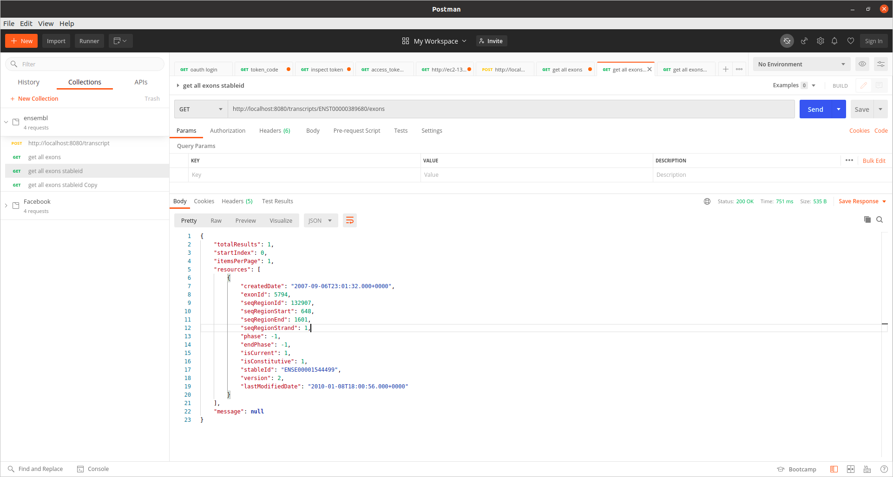
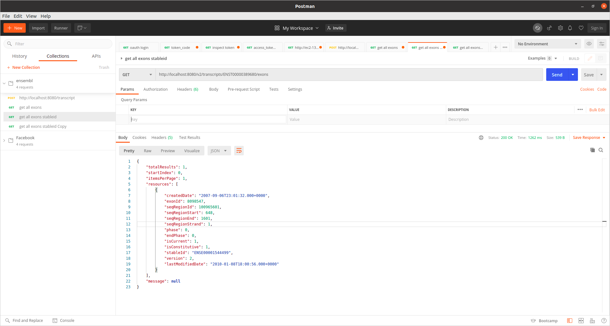

# ensembl_exon
This project exposes a REST endpoint to get All exons for given trancript stable id. 
JDK 1.8 needs to be installed. 
### Use below command to build project. 

``` sh
mvn clean package

```

We can deploy the war on tomcat. Use below curl command to retrieve all exons for given transcript stable id

```sh
curl --location --request GET 'http://localhost:8080/transcripts/ENST00000389680/exons'
```

- We are directly connecting to Public Ensembl DB. As no new DB was created, did not use flyway migration tool to create Databases and table. 
``` sh
db1.datasource.url=jdbc:mysql://ensembldb.ensembl.org:3306/homo_sapiens_core_104_38
db1.datasource.username=anonymous
```

### Multiple Databases
- At the same time we can connect to multiple DB without using any third party library and using same Entity model. This is demonstrated in the v2 API.
- In order to connect to second database, created 2 different entity manager. We can create as many entity manager and can connect to that many databases. 
- Databases can be MySQL, Oracle etc. Need to configure the database in application.properties file.
- The v2 API is connecting to below DB 
``` sh
db1.datasource.url=jdbc:mysql://ensembldb.ensembl.org:3306/homo_sapiens_core_75_37
db1.datasource.username=anonymous

# Curl command to call v2 API
curl --location --request GET 'http://localhost:8080/v2/transcripts/ENST00000389680/exons'
```
-The exons response for same transcript stable id is different for v1 and v2 API. Screenshot is attached. 

v1 API response


v2 API response


## Junits
- Created junits to execute integration test.
- Used inbuilt H2 DB. 
- Junits and it's resources can be found in folder 'src/test/'
